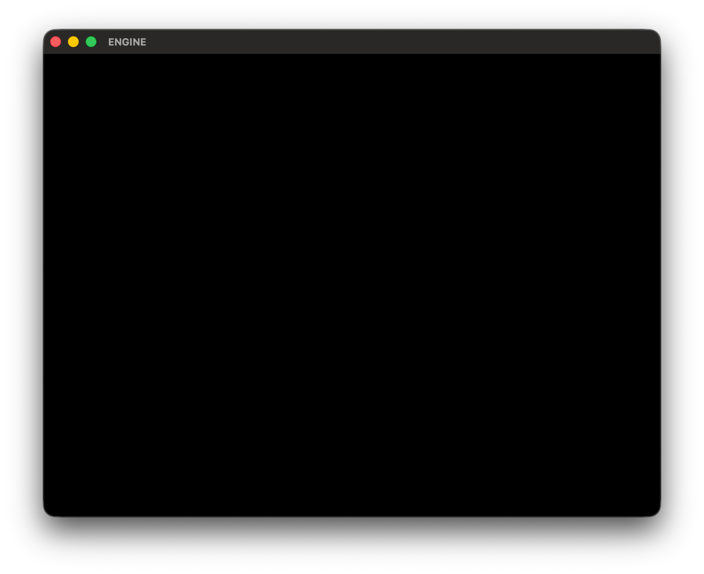
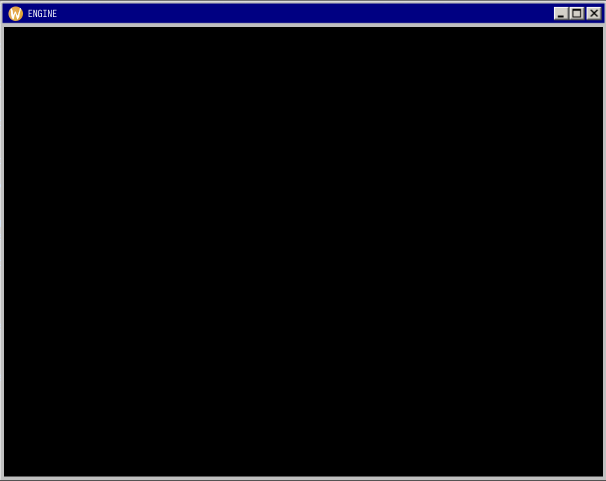
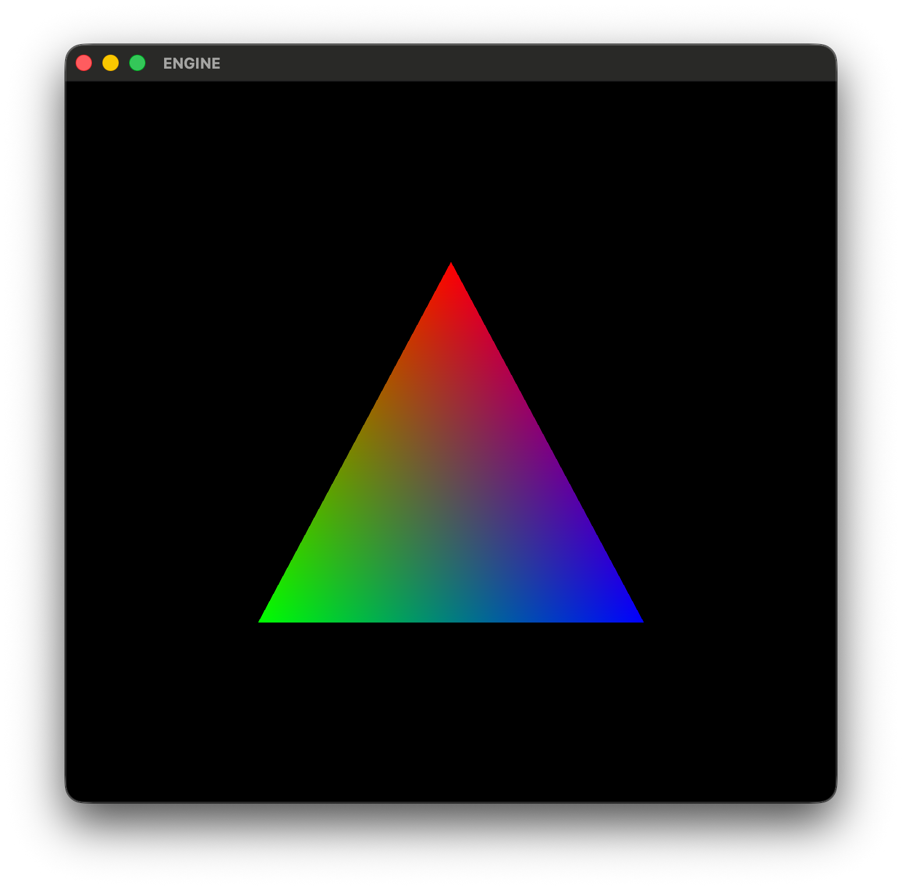

# GAME ENGINE

A small game engine written in C. This project is intended for learning C and
graphics programming.

- Window & Input: GLFW
- Graphics API: OpenGL

*Work in progress*

## PREVIEW

    
    

    

